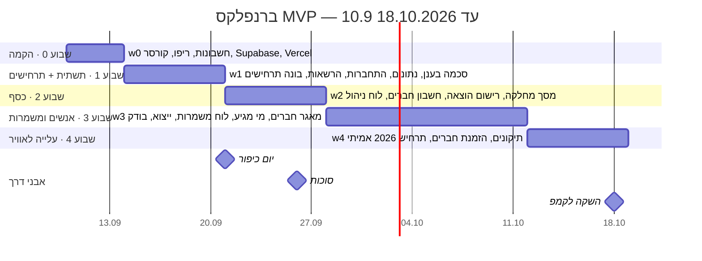

# ברנפלקס — תוכנית עבודה (גאנט) · MVP

עודכן: 10.9.2026 (ערב) · אירוע: נובמבר 2026 · קצב: כמעט כל יום · איפיון: `docs/burnflakes-spec-v2.md`
כל משימה מסומנת בקוד (w = שבוע, t = משימה). סטטוס: ⬜ לא התחיל · 🔵 בעבודה · ✅ הושלם ואושר בבדיקה ידנית.
כל שבוע נסגר ב**בדיקת הצלחה** אחת. כל משימה: מה, איפה, מי, איך יודעים שהיא גמורה.

---

## שבוע 0 · הקמה (10–13.9) — בדיקת הצלחה: הריפו בגיטהאב עם כל המסמכים, Supabase ו‑Vercel פתוחים, קורסר קורא את קובץ ההוראות

| קוד | משימה | איפה | מי | גמור כש… | סטטוס |
|---|---|---|---|---|---|
| w0t1 | פתיחת התיקייה `camp planner` בקורסר | Cursor → File → Open Folder | שי | רואים docs ו‑supabase בצד | ✅ |
| w0t2 | קובץ הוראות לקורסר + מבנה ריפו (README, .gitignore) | Claude כותב לתיקייה | Claude | הקבצים בתיקייה, שי רואה אותם בקורסר | ✅ |
| w0t3 | ריפו פרטי `burnflakes` בגיטהאב; Claude דוחף מה‑Mac (`$HOME/bfwork`) | GitHub API + git | Claude | הקבצים נראים ב‑github.com | ✅ |
| w0t4 | פרויקט Supabase חדש `burnflakes` (אזור EU) | דפדפן → supabase.com | שי | יש URL ו‑anon key; שמורים במנהל הסיסמאות | ✅ |
| w0t5 | צינור מיגרציות: `supabase/migrations/*.sql` רץ אוטומטית ב‑GitHub Actions מול Supabase (סוד `SUPABASE_DB_URL`) | GitHub Actions `db-migrate` | Claude | members = 51, shifts = 33, תרחיש 2025 = 44,390 | ✅ |
| w0t6 | פרויקט Vercel מחובר לריפו | דפדפן → vercel.com → Import | שי | כתובת https של האפליקציה (עדיין ריקה) | ⬜ |

## שבוע 1 · תשתית ותרחישים (14–20.9) — בדיקת הצלחה: תרחיש 2025 מציג 44,390 ₪; ראש מטבח בחשבון אמיתי רואה רק מטבח

| קוד | משימה | איפה | גמור כש… | סטטוס |
|---|---|---|---|---|
| w1t1 | פרויקט Next.js ריק, RTL, עברית, חיבור ל‑Supabase, טיפוסים מהסכמה | Cursor | דף "שלום" עולה ב‑localhost וב‑Vercel | ⬜ |
| w1t2 | התחברות בקישור קסם למייל; זיהוי החבר לפי מייל; SMTP חינמי (Resend) | Cursor + Supabase Auth | שי נכנס עם המייל שלו ורואה את שמו | ⬜ |
| w1t3 | תפקידים ו‑RLS: מנהל / ראש מחלקה / חבר; ת"ז למנהל בלבד | Cursor + SQL Editor | בדיקת הרשאות: חבר לא רואה חבר אחר | ⬜ |
| w1t4 | בונה תרחישים: לוח פרמטרים, תוצאה לפי מחלקה, סעיפים, הכנסות מתוכננות | Cursor | 2025 = 44,390; מסיבה 7,000 ⇒ 1,068 לחבר | ⬜ |
| w1t5 | השוואת תרחישים, שכפול, דריסה ידנית, אישור ⇒ תקציב קפוא | Cursor | תרחיש 2026 מאושר ומופיע כתקציב | ⬜ |
| w1t6 | בדיקת הצלחה של השבוע, צעד‑צעד | דפדפן | שי מאשר | ⬜ |

## שבוע 2 · כסף (21–27.9, יום כיפור 21.9) — בדיקת הצלחה: ייבוא 2025 מאוזן מול הגיליון; הוצאה מהנייד מופיעה בשלושה מסכים

| קוד | משימה | איפה | גמור כש… | סטטוס |
|---|---|---|---|---|
| w2t1 | מסך מחלקה: תקציב מול בפועל לפי סעיף, יתרה, רשימת הוצאות, חריגה באדום | Cursor | ראש מטבח רואה את המטבח בלבד | ⬜ |
| w2t2 | רישום הוצאה (נייד): מה, כמה, מי שילם, סעיף / לא מתוכנן, "יש קבלה" | Cursor | הוצאה נרשמת מהטלפון תוך 30 שניות | ⬜ |
| w2t3 | מחלקת אירוע גיוס: שורות הכנסה + רווח | Cursor | ריטריט מציג הכנסות − הוצאות | ⬜ |
| w2t4 | חשבון חברים: החשבון שלי; ספר חשבונות למנהל; אישור הוצאות; רישום תשלומים; סימון החזר | Cursor | ליאת 2025 = החזר כמו בגיליון | ⬜ |
| w2t5 | לוח ניהול: מספרים, מאזן הכנסות/הוצאות, התראות; גרסת חבר (תקציב בלבד) | Cursor | חריגה של מחלקה מופיעה אדומה | ⬜ |
| w2t6 | בדיקת הצלחה של השבוע | דפדפן + נייד | שי מאשר | ⬜ |

## שבוע 3 · אנשים ומשמרות (28.9–11.10, סוכות) — בדיקת הצלחה: ראש מטבח פותח משמרות ארוחה, חבר נרשם מהנייד; הבודק לא מוצא באג חוסם

| קוד | משימה | איפה | גמור כש… | סטטוס |
|---|---|---|---|---|
| w3t1 | מאגר חברים: רשימה, חיפוש, כרטיס חבר, יצירת חבר חדש | Cursor | חבר חדש נוצר ומופיע במאגר | ⬜ |
| w3t2 | "מי מגיע השנה": סימון מהמאגר, מעמד, תפקיד, מחלקה, כרטיס; פתיחת שנה | Cursor | 37/50 מסומנים ל‑2026 | ⬜ |
| w3t3 | לוח משמרות: תפקידים, משמרות לפי יום/חד‑פעמיות, שיבוץ, הרשמה עצמית, המשמרות שלי, לוח יומי | Cursor | חבר נרשם למקום פנוי מהנייד | ⬜ |
| w3t4 | ייצוא לאקסל — כפתור אחד | Cursor | קובץ עם גיליון לכל טבלה | ⬜ |
| w3t5 | בודק עצמאי עובר על כל המסכים; תיקונים | Claude (סוכן בודק) + Cursor | דוח בודק בלי באג חוסם | ⬜ |
| w3t6 | בדיקת הצלחה של השבוע עם 2 ראשי מחלקות | נייד | שניהם אישרו שנוח | ⬜ |

## שבוע 4 · עלייה לאוויר (12–18.10) — בדיקת הצלחה: כל החברים נכנסו פעם אחת; תרחיש 2026 אמיתי מאושר

| קוד | משימה | איפה | גמור כש… | סטטוס |
|---|---|---|---|---|
| w4t1 | תיקונים ממשוב ראשי המחלקות | Cursor | רשימת המשוב סגורה | ⬜ |
| w4t2 | בניית תרחיש 2026 האמיתי ואישורו | המערכת | דמי קמפ 2026 מפורסמים | ⬜ |
| w4t3 | הזמנת כל החברים + הודעת הדרכה של 10 דקות בוואטסאפ | וואטסאפ + המערכת | 37 כניסות ראשונות | ⬜ |
| w4t4 | גיבוי ראשון (ייצוא), עדכון מסמך שיטת העבודה | המערכת + Claude | קובץ גיבוי בדרייב | ⬜ |

---

## שלב 2 (אחרי האירוע, לא מתוזמן)
תזכורות וואטסאפ · קליטת תשלומים אוטומטית · החלפת משמרות · קמפים נוספים · העלאת קבלות אם יתברר שצריך.

## יומן החלטות
10.9.2026 — שינוי סכמה = קובץ מיגרציה חדש `supabase/migrations/NNNN_*.sql`; דחיפה ל‑main מריצה אותו אוטומטית בענן. Claude דוחף ומריץ, שי מאשר בתצוגה חיה.
7.9.2026 — 16 החלטות עסקיות נסגרו (ראו איפיון v1.3 סעיף 9) + סבב "מה מורידים" (איפיון v2).
