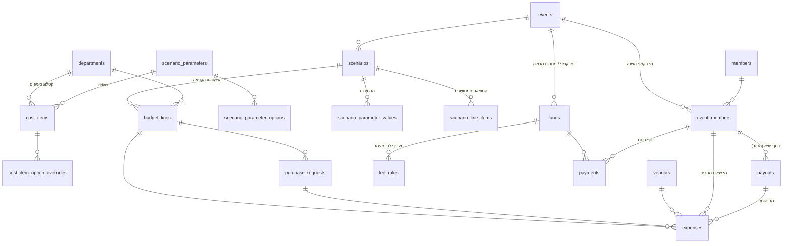

# מערכת תקציב ברנפלקס — ניתוח, מודל נתונים ותוכנית עבודה (v0.1)

תאריך: 7.9.2026 · שלב: תכנון, לפני כתיבת קוד · מצורף: `schema.sql` (מבנה הטבלאות והלוגיקה) ו‑`seed_2025.sql` (כל הסעיפים, המחלקות, ההערכות והחברים מקובץ 2025).

---

## 1. מה למדתי מהקובץ של 2025

הקובץ מכיל למעשה ארבעה "עולמות" שונים שחיים באותו מקום בלי מפתח משותף:

| גיליון | מה יש בו | מה זה אומר למערכת |
|---|---|---|
| הערכה ראשונית | 7 מחלקות, 43 סעיפי עלות, סה"כ 44,390 ₪, 35 חברים ⇒ דמי קמפ 1,268 ₪ | זה **תרחיש** — קטלוג סעיפים + פרמטר אחד (מספר חברים) שמחלק את הסכום |
| תקציב בפועל | אותן מחלקות, 57 שורות, סה"כ 48,179 ₪, 36 חברים, חלק מהשורות עם "שולם ע"י". צבע התא מסמן מצב: אדום = הערכה, שחור = שולם, ירוק = הוחזר | **הוצאות** עם מצב (status) ומשלם. הצבעים הופכים לשדה `status` |
| תשלומים | לכל חבר: כמה העביר, כמה הוציא מהכיס, כמה להחזיר, פלוס "החזר קמפ" של 41.75 ₪ לכל אחד; טבלת מחסן (275 ₪ × 41); עינת עם חלק יחסי 0.81 | **ספר חשבונות לחבר** — תשלומים נכנסים, הוצאות שחבר שילם מכיסו, וחלוקת העודף |
| פירוטים עומרי | 18 תשלומים לספקים (הובלה, מים, שירותים, מחסן שנתי 11,000 ₪) שעומרי שילם מראש — 24,888 ₪ | **ספקים** + דפוס של "משלם גדול" שמקדים כסף ומקבל החזר |
| מכולת ברנפלקס | 49 אנשים עם מעמד (גרעין / סוג של גרעין / חבר של / בן זוג) וסכום מדורג (250 / 100 / 50) | **קופה נפרדת** עם תעריף לפי מעמד חבר, שלא נכנסת לחישוב ההחזרים |

שלוש בעיות מבניות שהמערכת פותרת:

1. **אותו כסף מופיע ב‑3 מקומות.** למשל "מקדמה עומרי 5,133" נמצאת גם בשורת רשת הצל, גם ב"כמה הוציא" של עומרי, וגם בפירוטים שלו — בלי קשר ביניהם, ולכן אי אפשר לדעת אוטומטית אם ספרו אותו פעמיים. במודל החדש יש **שורת הוצאה אחת** שמשויכת גם למחלקה וגם למי ששילם.
2. **המצב נמצא בצבע של התא.** אי אפשר לשאול "מה עוד לא הוחזר?". במודל החדש זה שדה.
3. **חישוב ההחזר מפוזר בנוסחאות ידניות** (הפרש 100 ₪ למי שהעביר 1,250 במקום 1,350, החלק היחסי של עינת, ה‑41.75). במודל החדש זו נוסחה אחת ב‑view.

### הנוסחה שמשחזרת את גיליון "תשלומים"

בדקתי אותה מול הקובץ (ליאת 362, יואב 17, עינת 34 — מתאים לשקל):

```
עודף הקופה      = סך התשלומים שנכנסו (דמי קמפ + מחסן) − סך כל ההוצאות
חלק בעודף לחבר  = עודף × חלק_ההשתתפות של החבר / סכום חלקי ההשתתפות של כולם
יתרה לחבר       = חוב_לפי_תעריף − שילם − הוציא_מהכיס − חלק_בעודף
                  יתרה חיובית = החבר חייב לקמפ · יתרה שלילית = הקמפ מחזיר לחבר
```

---

## 2. מודל הנתונים (Supabase / PostgreSQL)

### מבט על



### הטבלאות, לפי שכבות

**שכבה 1 — מי ומה (רפרנס)**

| טבלה | תפקיד | שדות עיקריים |
|---|---|---|
| `events` | אירוע/שנה. הכל מפוצל לפי שנה כדי שהמערכת תשרת גם 2027 | `year`, `status` |
| `departments` | 7 המחלקות מ‑2025 (לוגיסטיקה, מטבח, ארט, גיפט, שירוקלחת, מיצג/חדר ילדים, שונות) | `slug`, `name_he` |
| `members` | אדם, פעם אחת לכל החיים | `first_name`, `last_name`, `phone` (לוואטסאפ), `auth_user_id` |
| `event_members` | החברות של אדם באירוע מסוים | `tier` (גרעין / סוג של גרעין / חבר של / בן זוג), `role` (admin / treasurer / dept_lead / member), `participation_share` (1 = מלא, 0.81 = עינת), `attending` |
| `department_leads` | מי ראש מחלקה השנה | |
| `vendors` | ספקים (נגב אקולוגיה, שירותטבע, מוחמד הסעות…) | |

**שכבה 2 — מנוע התרחישים (הלב של הדרישה השנייה)**

| טבלה | תפקיד | שדות עיקריים |
|---|---|---|
| `scenario_parameters` | ה"כפתורים" בלוח ההגדרות: מספר חברים, סוג הצללה, שטח הצללה, מספר ארוחות, רמת גיפט, אחוז רזרבה | `key`, `value_type` (number / enum / boolean), `default_value` |
| `scenario_parameter_options` | הערכים האפשריים לכפתור מסוג enum (רשת צל / מפרשים / בלי) | |
| `cost_items` | **קטלוג הסעיפים** — 43 השורות מההערכה של 2025. לכל סעיף: איך הכמות נקבעת (`quantity_driver`: קבוע / לפי חבר / לפי מ"ר / לפי ארוחה), מחיר ליחידה, ותנאי קיום (`applies_when`, למשל רק אם סוג ההצללה = רשת) | `department_id`, `quantity_driver`, `driver_param_key`, `unit_cost`, `applies_when` |
| `cost_item_option_overrides` | "אם רמת הגיפט = מושקע, מחיר הקורנפלקס ליחידה ×1.6" | |
| `scenarios` | תרחיש בשם ("36 חברים, רשת צל, גיפט רגיל"), אפשר לשכפל | `status` (draft / approved / archived), `cloned_from` |
| `scenario_parameter_values` | הבחירות של התרחיש הזה | |
| `scenario_line_items` | **התוצאה**: שורה לכל סעיף שחל, עם כמות × מחיר. שורה שנערכה ידנית מסומנת `is_override` והחישוב לא דורס אותה | |

**שכבה 3 — התוכנית המאושרת והביצוע (דרישות 1 ו‑3)**

| טבלה | תפקיד | שדות עיקריים |
|---|---|---|
| `budget_lines` | עותק קפוא של התרחיש שאושר. זה "התקציב" שמולו מודדים | `planned_amount` |
| `purchase_requests` | בקשת רכש של ראש מחלקה: מה, כמה בערך, מול איזה סעיף | `status` (pending / approved / rejected / purchased) |
| `expenses` | **מקור האמת היחיד לכסף שיצא.** כל שורה: מחלקה, סעיף, ספק, מי שילם, מאיפה (`paid_from`: כיס של חבר / חשבון הקמפ / מקדמה), מצב, קבלה | `amount`, `paid_by_event_member_id`, `status`, `payout_id` |

**שכבה 4 — כסף נכנס ויוצא**

| טבלה | תפקיד | שדות עיקריים |
|---|---|---|
| `funds` | "סבב גבייה": דמי קמפ, מחסן שנתי, מכולה. דגל `in_refund_pool` קובע אם העודף שלו מתחלק בחזרה | |
| `fee_rules` | כמה כל מעמד משלם לכל קופה (מכולה: גרעין 250, חבר של 100) | |
| `member_charge_overrides` | חריגים ("גילי — לפחות 500") | |
| `payments` | כסף שנכנס מחבר: סכום, אמצעי (paybox / bit / העברה / מזומן / קיזוז), מי קיבל (״העבירה בביט לניב״), `external_ref` לאוטומציה | |
| `payouts` | כסף שיצא לחבר (החזר), עם קישור להוצאות שכוסו | |

**שכבה 5 — תשתית לאוטומציות (דרישה 4)**: `notifications` (תור הודעות וואטסאפ עם תבנית ומצב), `integration_inbox` (webhook גולמי מ‑PayBox/Bit שמעובד אחר כך), `audit_log`.

### ה‑views שמחליפים את הגיליונות

| view | מחליף את | מה מחזיר |
|---|---|---|
| `v_scenario_summary` | שורת "סה"כ / חברי קמפ / דמי קמפ" | סה"כ תרחיש, רזרבה, דמי קמפ לחבר |
| `v_scenario_by_department` | שורת הסיכום של כל מחלקה | |
| `v_department_budget_vs_actual` | תקציב בפועל מול הערכה | מתוכנן / בפועל לכל מחלקה |
| `v_member_charges` | "כמה אני מצפה שישלם" | חוב לפי מעמד × חלק השתתפות, או חריג |
| `v_member_ledger` | גיליון "תשלומים" כולו | חוב, שילם, הוציא מהכיס, חלק בעודף, יתרה |

---

## 3. איך מנוע התרחישים עובד מתחת למכסה

זרימה של תרחיש אחד, צעד אחרי צעד:

1. **יוצרים תרחיש** (או משכפלים קיים) ובוחרים ערכים לכל פרמטר בלוח ההגדרות. מה שלא נבחר מקבל את ברירת המחדל של הפרמטר.
2. **קוראים לפונקציה** `compute_scenario(scenario_id)` (RPC אחד מה‑UI). היא עוברת על כל סעיף פעיל בקטלוג ועושה שלושה דברים:
   * **סינון** — אם לסעיף יש `applies_when` (למשל `{"shade_type":"net"}`) והבחירה בתרחיש שונה, הסעיף פשוט לא נכנס. ככה "סוג הצללה" מחליף קבוצת סעיפים שלמה.
   * **כמות** — `fixed` = הכמות הבסיסית; `per_member` = בסיס × מספר החברים; `per_sqm` = בסיס × שטח ההצללה; `per_meal` = בסיס × מספר הארוחות.
   * **מחיר** — מחיר היחידה של הסעיף, אלא אם יש override לאפשרות שנבחרה (גיפט מושקע ⇒ ×1.6).
3. **התוצאה** נכתבת ל‑`scenario_line_items`. שורות שסומנו ידנית כ‑override נשארות כמו שהן.
4. **הסיכום** מגיע מ‑`v_scenario_summary`: סה"כ, פלוס רזרבה, חלקי מספר חברים = דמי קמפ. משווים כמה תרחישים זה לצד זה.
5. **אישור** — `approve_scenario(id)` מקפיא את השורות ל‑`budget_lines`. מכאן ראשי המחלקות עובדים מול תקציב קבוע, ותרחישים אחרים עוברים לארכיון.

בדיקה שעשיתי על מסד נתונים מקומי: הזנתי את 43 הסעיפים מההערכה של 2025 עם 35 חברים, הרצתי `compute_scenario`, וקיבלתי **44,390 ₪ ו‑1,268.29 ₪ לחבר** — בדיוק כמו בגיליון. שינוי מספר החברים ל‑36 או רמת הגיפט ל"מושקע" משנה מיד את הסכומים.

מה כבר "פרמטרי" בקטלוג המיובא: רשת צל (15.65 ₪ למ"ר × שטח), קורנפלקס וחלב (לפי חבר), ארוחות ערב (400 ₪ לארוחה, לפי גיליון המשמרות) וארוחות בוקר (300), סבון ושמפו (לפי חבר). כל השאר יובא כסכום קבוע ואפשר להפוך אותו לפרמטרי מתי שרוצים.

---

## 4. תוכנית עבודה ל‑MVP (יחידות של שבוע, כל שבוע עם בדיקת הצלחה אחת)

| שבוע | מה בונים | בדיקת ההצלחה שסוגרת את השבוע |
|---|---|---|
| **0 — החלטות עסקיות (לפני קוד)** | סוגרים את רשימת ההחלטות בסעיף 5 | יש תשובה כתובה לכל שאלה |
| **1 — מסד הנתונים** | פרויקט Supabase, הרצת `schema.sql`, הרצת `seed_2025.sql`, התאמות ידניות לייבוא | `v_member_ledger` מחזיר לכל חבר של 2025 את אותו החזר שבגיליון "תשלומים", לשקל |
| **2 — מנוע תרחישים** | לוח הגדרות (פרמטרים), מסך קטלוג סעיפים, השוואת 2–3 תרחישים | תרחיש "2025" מחזיר 44,390; תרחיש "2026: 40 חברים, מפרשים, גיפט מושקע" נותן מספר חדש בלי לגעת בקוד |
| **3 — מודול מחלקות** | הרשאות (RLS) לפי תפקיד, מסך מחלקה: תקציב מול בפועל, בקשות רכש, רישום הוצאה עם קבלה | ראש מחלקה נכנס ורואה **רק** את המחלקה שלו, פותח בקשה, אתה מאשר, הוא רושם הוצאה והיא מופיעה מול הסעיף |
| **4 — כסף נכנס ויוצא** | מסך גזבר: קופות, תעריפים, רישום תשלומים, ספר חשבונות לחבר, סימון החזרים | מסך אחד עונה על "מי עוד לא שילם" ו"למי מגיע החזר וכמה", ומסמן החזר כבוצע |
| **5 — הקשחה** | סוכן בודק עצמאי (qa-tester) עובר על כל המסכים, ייצוא לאקסל, לוג שינויים | הבודק לא מוצא באג חוסם; אתה מאשר שחרור לקמפ |
| **אחרי ה‑MVP** | webhook מ‑PayBox/Bit לתוך `integration_inbox`; תזכורות וואטסאפ מתוך `notifications`; חיבור לוגין של חברים | |

### מיפוי ארבעת המודולים למודל

| מודול | טבלאות | views / פונקציות | מסך |
|---|---|---|---|
| Scenario Builder | `scenario_parameters`, `cost_items`, `scenarios`, `scenario_line_items` | `compute_scenario`, `approve_scenario`, `v_scenario_summary` | לוח הגדרות + השוואת תרחישים |
| Department Dashboards | `budget_lines`, `purchase_requests`, `expenses` | `v_department_budget_vs_actual` | מסך מחלקה (RLS מסנן לפי `department_leads`) |
| Members Ledger | `funds`, `fee_rules`, `payments`, `expenses`, `payouts` | `v_member_charges`, `v_member_ledger` | מסך גזבר + "החשבון שלי" לחבר |
| Management Dashboard | הכל | `v_management_dashboard` (סה"כ נגבה, סה"כ הוצא, יתרת קופה, חריגה לכל מחלקה, מי לא שילם) | מסך מנהל |

### Retool מול Streamlit

| | Retool | Streamlit |
|---|---|---|
| מהירות ל‑MVP | גבוהה מאוד — טבלאות, טפסים והרשאות מוכנים מעל Supabase | גבוהה, אבל כל טבלה עריכה/טופס נכתב בקוד |
| Scenario Builder (מחוונים, השוואה, גרפים) | אפשרי, מסורבל | הכי טבעי — sliders, selectbox, גרפים בשורה אחת |
| ראשי מחלקות מהנייד | טוב (Retool Mobile) | בינוני (responsive בסיסי) |
| הרשאות | מובנה, מחובר ל‑Supabase Auth | צריך לבנות (login + RLS דרך supabase‑py) |
| עלות | חינם עד 5 משתמשים, אחר כך לפי משתמש — 40 חברים = יקר | חינם (Streamlit Community Cloud / שרת קטן) |
| התאמה לסוכני AI / Claude Code | פחות — קוד חי בתוך הפלטפורמה | מלאה — Python בריפו, קל לסוכן לכתוב ולבדוק |

**המלצה:** Streamlit, בגלל שלושה דברים: מנוע התרחישים הוא הליבה של המוצר וזה בדיוק החוזק של Streamlit; אתה עובד עם Claude Code וסוכן qa, ו‑Python בריפו נותן להם שליטה מלאה; ומחיר Retool לפי משתמש לא מתאים ל‑40 חברי קמפ. אם רק ראשי מחלקות (5–7 אנשים) נכנסים למערכת והחברים מקבלים דו"ח בוואטסאפ — Retool חוזר להיות אופציה, כי אז נשארים בחינם. הלוגיקה בכל מקרה יושבת ב‑Postgres (פונקציות ו‑views), כך שהחלפת ממשק בעתיד לא נוגעת בחישובים.

---

## 5. החלטות עסקיות לסגור לפני שבוע 1

1. **תעריפים לפי מעמד** — האם דמי הקמפ שווים לכולם (ב‑2025: כן, 1,350) או מדורגים כמו המכולה? ומה עם "בן זוג"?
2. **חלק בעודף** — האם מי שלא הגיע לאירוע (רק שילם מכולה) מקבל חלק בעודף? (במודל: לא — רק `attending`).
3. **מי מאשר בקשת רכש** — אתה בלבד, או גם גזבר / ראש מחלקה עד סכום מסוים?
4. **מחסן ומכולה** — האם קופת המחסן השנתית נכנסת לקופת ההחזרים כמו ב‑2025 (כן בקובץ), והמכולה נשארת בחוץ?
5. **רזרבה** — האם לגבות דמי קמפ עם רזרבה (למשל 5%) ולהחזיר בסוף, או לגבות מדויק ולהשלים אחר כך?
6. **מבנה מחלקות** — "מיצג" הפך ב‑2025 בפועל ל"חדר ילדים" (גיא, 2,000 ₪). להשאיר מחלקה אחת או לפצל?
7. **קמפ אחד או רב‑קמפים** — המודל תומך בקמפ אחד. אם קליר ויז'ן תרצה למכור את זה לקמפים אחרים, מוסיפים `camp_id` עכשיו (זול) ולא אחר כך (יקר).

---

## 6. הערות על הייבוא של 2025 (מה נכנס ל‑seed ומה נשאר לטיפול ידני)

* נכנסו: 7 מחלקות, 43 סעיפי הערכה כקטלוג, תרחיש "הערכה ראשונית 2025" מאושר, 49 חברים עם מעמד, 3 קופות עם תעריפים, תשלומי דמי קמפ (37), מחסן (39), מכולה (44), 28 הוצאות מהכיס מעמודת "כמה הוציא", 8 ספקים.
* **נשאר לטיפול ידני**: 57 שורות "תקציב בפועל" נכנסו לטבלת ביניים `legacy_2025_department_actuals` ולא ל‑`expenses`, כי בקובץ אין קשר בין שורת מחלקה למי ששילם — אחרת היינו סופרים את אותו הכסף פעמיים. בשבוע 1 נצמיד כל שורה להוצאה של החבר (זה בדיוק ההתאמה שהמערכת תעשה אוטומטית מ‑2026 והלאה).
* פערים קטנים בין הסיכום שלי (נאסף 59,825 / הוצא 59,318) לבין הגיליון (60,975 / 59,438) נובעים משמות שלא הצלחתי להתאים בוודאות ומשורת "עומרי 1" (6,758 שהוצאו מול 5,233 להחזיר). זה בדיוק מה שבדיקת ההצלחה של שבוע 1 סוגרת.

---

## 7. מה למדנו מקובץ 2022 (נוסף ב‑7.9.2026)

הקובץ של 2022 הוא בעיקר תבנית (גיליון "בפועל" ו"דמי קמפ" ריקים), אבל יש בו ארבעה דברים ששינו את המודל:

| מה יש ב‑2022 | מה זה אומר | מה שונה במודל |
|---|---|---|
| **שני תקציבים זה לצד זה** — "ראשוני" 57,150 ₪ ו"מצומצם" 40,610 ₪ (50,160 עם מחסן), עם באפר של 2,000 ₪ בכל אחד | זה בדיוק "תרחישים" שנעשו ביד. ההבדלים ביניהם הם פרמטרים: שטח רשת צל 500 מול 450 מ"ר, אלכוהול 3,500 מול 2,500, ארט 4,300 מול 2,500, ארוחות 1,250/1,500 מול 1,100/1,100 | נוסף פרמטר `buffer_amount` (רזרבה בסכום קבוע, לצד האחוז). שני התרחישים של 2022 נטענו ל‑DB כתרחישים בארכיון, ואפשר להשוות אותם ל‑2025 באותו מסך |
| **מבנה מחלקות שונה** — חשל"ש, לוגיסטיקה/בטיחות, הקמות, מקלחת ושירותים, מטבח, גיפט, ארט. ב‑2025 חשל"ש והקמות נבלעו בלוגיסטיקה, ונוספו מיצג ושונות. גם "קרח" עבר ממטבח (2022) ללוגיסטיקה (2025) | המחלקות משתנות משנה לשנה, וסעיף יכול לעבור מחלקה | נוספה טבלת `event_departments` (אילו מחלקות פעילות השנה). המחלקה בקטלוג היא ברירת מחדל בלבד — שורת התקציב והשורת ההוצאה נושאות את המחלקה שלהן |
| **גיליון "החזרים"** עם העמודות: למי, על מה, מחלקה, סכום, האם שולם ע"י הקמפ, החזר נדרש בפועל, האם הוחזר ומאיפה | זה טופס בקשת החזר לכל הוצאה — כבר קיים כטבלת `expenses` עם `paid_from` ו‑`status` | אישוש למודל, בלי שינוי |
| **"יש / יצא / נשאר"** לשלושה מקומות שבהם הכסף יושב: פייבוקס, "מסיבה שלוותה", חשבון הבנק של הגזבר | הכסף של הקמפ מפוזר בכמה כיסים, ויש גם הלוואה מאירוע אחר | נוספה טבלת `accounts` (איפה הכסף פיזית), עמודת `account_id` בתשלומים ובהוצאות, ו‑view חדש `v_account_balances` שמחליף את הבלוק הזה |

עוד שלוש עובדות שימושיות: מחיר רשת הצל יציב לאורך השנים (16 ₪ למ"ר ב‑2022, 15.65 ב‑2025) ולכן הקטלוג הפרמטרי אמין; המחסן השנתי עלה מ‑9,600 ל‑11,000 ₪ ובשתי השנים התלבטו אם הוא "בתוך" התקציב או בנפרד — ולכן הוא קופה נפרדת במודל; ו‑19 מתוך 21 השמות ברשימת 2022 מופיעים גם ב‑2025, כלומר טבלת `members` הרב‑שנתית משתלמת מיד.

שתי טעויות חישוב שהמערכת הייתה תופסת: בגיליון "מצומצם" כתוב 48,160 עם מחסן, אבל הסכום האמיתי של השורות הוא 48,260; ובגיליון "תשלומים" של 2025 "תקציב שנאסף" הוא 60,975 בעוד סכום העמודות הוא 60,375 — פער של 600 ₪ שניפח את ההחזר לחבר מ‑25 ל‑41.75 ₪.


---

## 8. הכנסות — לא רק דמי קמפ (נוסף ב‑7.9.2026)

בקשה של שי: לכל מודול יש גם צד הכנסות, ודמי קמפ הם הכנסה במאזן כמו כל הכנסה אחרת. מה השתנה בסכמה:

| טבלה / view | תפקיד |
|---|---|
| `funds` — הורחב | סוגי קופה חדשים: `fundraiser`, `donation`, `sponsorship`, `sale`, `carryover`. דגל `from_members` מבדיל בין קופה שנגבית מחברים לפי תעריף לבין הכנסה חיצונית |
| `fundraisers` | פעילות גיוס (מסיבה / ריטריט / מכירה) עם הכנסה ועלות מתוכננות, תאריך, אחראי |
| `incomes` | כל הכנסה שאינה תשלום חבר לפי תעריף: מקור, קטגוריה, גיוס משויך, מחלקה (אופציונלי), חשבון שאליו נכנס |
| `expenses.fundraiser_id` | הוצאה יכולה להשתייך לגיוס (די ג'יי למסיבה) ⇒ נטו לגיוס |
| `scenario_income_lines` + `budget_income_lines` | הכנסות מתוכננות בתרחיש, מוקפאות באישור. **דמי קמפ לחבר = (הוצאות + רזרבה − הכנסות אחרות) ÷ חברים** |
| `v_event_balance` | המאזן: צד הכנסות לפי קטגוריה (דמי קמפ בפנים), צד הוצאות לפי מחלקה, מתוכנן ובפועל |
| `v_fundraiser_net` | לכל גיוס: הכנסות, עלויות, נטו — מתוכנן ובפועל |
| `v_member_ledger`, `v_account_balances`, `v_management_dashboard` — עודכנו | הכנסות חיצוניות בקופה "בקופת ההחזרים" נכנסות לעודף לחלוקה; יתרות חשבונות ולוח הניהול כוללים אותן |

בדיקה על 2025: מסיבה מתוכננת של 7,000 ₪ מורידה את דמי הקמפ מ‑1,268 ל‑1,068 ₪; מסיבה בפועל (8,500 נכנס, 1,800 עלויות) מציגה נטו 6,700 מול 7,000 מתוכנן, והחזר של ליאת גדל בהתאם.


---

## 9. מה למדנו מקובץ "ברנפלקס 2026" (משאבי אנוש, כרטוס, סקר הגעה, לו"ז הגעה, משמרות, גאנט)

| גיליון | מה יש בו | מה נוסף למודל |
|---|---|---|
| משאבי אנוש | 50 איש: שם, ת"ז, טלפון, מייל, מחלקת התנדבות, תחום הובלה, מעמד (גרעין / שנה שנייה / בני זוג / "לא באה"). 37 מסומנים לשנה, 13 ברשימה הרחבה | `members` הוא **מאגר** רב‑שנתי עם פרטי קשר; `event_members.attending` = מי מגיע השנה. מעמד חדש `second_year`. שדות `volunteer_dept`, `lead_area`, `ticket_status`. ת"ז — בטבלה נפרדת `member_private` שרק מנהל רואה |
| תבנית כרטוס קמפ | 34 שורות: טלפון, ת"ז, שם, מייל, הקצאה/חבר | `ticket_status` (allocation / self_bought / needs_volunteer / no_ticket) + ייצוא לתבנית |
| תוצאות סקר | לכל חבר: ימי הקמות, הגעה, עזיבה, רכב ומקומות, פירוקים, העמסה/פריקה, אוהל ושותפים | `event_member_logistics` |
| לו"ז הגעה | רשת נוכחות: 36 איש × 9 ימים; סה"כ 14/14/11/26/34/36/36/36/25 | `event_member_presence` + `v_event_member_days` — **227 ימי‑חבר**. זה המספר שכמויות מטבח, קרח ומים צריכות להיגזר ממנו, לא "36 חברים" |
| משמרות | לכל יום: צוות הקמות (11 + אקסטרה), ארוחת ערב, ברמן/ית ×2, משחקים ×2, ניקיון ×2, קרח ×2, חדר ילדים; תיאור לכל תפקיד; תקציב ארוחה 400 ₪; העמסת/פירוק משאית | `shift_roles`, `shifts`, `shift_assignments`; `v_shift_board`, `v_shift_availability` (רק מי שנוכח באותו יום); הוצאה משויכת למשמרת ⇒ 400 ₪ לארוחה מול בפועל |
| Gantt + מפגש שני | ציר זמן: מפגשים, הקמות 20–23.11, אירוע 24–29.11, דיקומפרשן 4.12. סיכום ישיבה: דמי קמפ יעד 1,000–1,300, 9 מצטרפים חדשים, ריטריט גיוס באברהם הוסטל עם 9 סדנאות ובר, מיצג חדר ילדים 1,000–2,000 ₪ שהביא 3 הקצאות | `event_milestones`. הריטריט = `fundraisers`; "3 הקצאות למיצג" = הכנסה בשווה‑כסף שכדאי לתעד כהערה על הגיוס |

מה נטען ב‑`seed_2026.sql`: אירוע 2026, 12 מחלקות (כולל הקמות, סלון, שירותים, מרפאה, חשל"ש), 50 חברים עם טלפון ומייל (37 מגיעים), 11 ראשי מחלקות, מצב כרטיס ל‑34, סקר הגעה ל‑34, נוכחות ל‑35 × 9 ימים, 9 תפקידי משמרת, 33 משמרות, ושיבוץ צוות ההקמות של 21.11. **לא נטענו מספרי ת"ז** — הם בקובץ שלך, ויוזנו לטבלה המוגבלת רק אם תחליט כך (החלטה 14).

הערה על התאריכים: הקובץ מתאר את האירוע של נובמבר 2025 (התכנון ל"2026" נעשה בו). האירוע במערכת נקרא 2026 עם תאריכי 2025 — לעדכן כשיהיו תאריכים אמיתיים.
