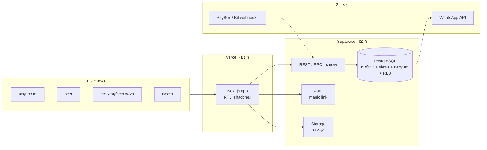

# ברנפלקס — מסמך איפיון מערכת התקציב (v1.3 — החלטות סגורות)

תאריך: 7.9.2026 · מסמך זה הוא **הבסיס לבנייה בקורסר**. מה שכתוב כאן הוא מה שייבנה; מה שלא כתוב — לא ייבנה ב‑MVP.
כל מקום שמסומן ⬜ **שי משלים** — מחכה לך. מסמכים נלווים בפרויקט: `db/schema.sql` (מבנה הנתונים המלא), `db/seed_2025.sql` + `db/seed_2022.sql` + `db/seed_2026.sql` (נתוני אמת: תקציבים, רשימת חברים, נוכחות, משמרות), `design/burnflakes-design-v0.1.md` (הניתוח והלקחים מהקבצים), והדמו האינטראקטיבי.

---

## 0. איך משתמשים במסמך הזה

1. שי עובר על המסמך, מתקן ומוסיף (בעיקר סעיפים 3, 4 ו‑10).
2. סוגרים את ההחלטות בסעיף 9 — לפני שורת קוד ראשונה.
3. המסמך + `schema.sql` נכנסים לריפו, וקורסר בונה לפיהם שבוע אחרי שבוע (סעיף 8). כל שבוע נגמר ב"בדיקת הצלחה" אחת.

---

## 1. חזון ומטרות

**משפט אחד:** מערכת אחת שבה מנהל הקמפ בונה תקציב מתרחישים — הוצאות **והכנסות** — ראשי מחלקות מנהלים את הכסף שלהם לבד, וכל חבר יודע בכל רגע כמה הוא חייב או כמה מגיע לו — בלי אקסל.

**מה זה מחליף:** גיליון הערכה ראשונית, גיליון תקציב בפועל, גיליון תשלומים, פירוטי ספקים של "המשלם הגדול", גיליון מכולה, וגיליון החזרים של 2022.

**מדדי הצלחה ל‑MVP (מידברן 2026):**

| מדד | יעד |
|---|---|
| התקציב של 2026 נבנה במערכת ולא באקסל | כן / לא |
| כל ראשי המחלקות רושמים הוצאות בעצמם | 100% מההוצאות מעל 100 ₪ רשומות עם קבלה תוך 7 ימים |
| חישוב ההחזרים בסוף האירוע | אוטומטי, בלי נוסחאות ידניות, סגור תוך שבוע מהאירוע |
| טעויות סיכום (כמו ה‑600 ₪ של 2025 וה‑100 ₪ של 2022) | אפס — אין סכום שמוקלד ידנית |
| עלות תשתית | 0 ₪ לחודש |

**מחוץ ל‑MVP (שלב 2):** גבייה אוטומטית דרך אפליקציות תשלום, תזכורות וואטסאפ, קמפים נוספים, אפליקציה מותקנת.

---

## 2. משתמשים ותפקידים

| תפקיד | מי זה בברנפלקס | מה הוא צריך מהמערכת | כמה כאלה |
|---|---|---|---|
| **מנהל קמפ (admin)** | שי ⬜ + ? | לבנות תרחישים, לאשר תקציב, לאשר בקשות רכש, לראות הכל | 1–2 |
| **גזבר (treasurer)** | ⬜ (ב‑2025 ניב וגם עומרי "המשלם הגדול") | לרשום תשלומים שנכנסו, לסמן החזרים, לראות יתרות בכל חשבון | 1–2 |
| **ראש מחלקה (dept_lead)** | מטבח, לוגיסטיקה, ארט, גיפט, שירוקלחת, מיצג/חדר ילדים ⬜ | לראות את התקציב שלו, לבקש רכש, לרשום הוצאות עם קבלה | 6–8 |
| **חבר קמפ (member)** | ~40 | לראות את החשבון שלו בלבד: כמה שילם, כמה הוציא, מה היתרה | 35–50 |

**מטריצת הרשאות (זה מה שנכנס ל‑RLS ב‑Supabase):**

| פעולה | admin | treasurer | dept_lead | member |
|---|---|---|---|---|
| תרחישים: יצירה / עריכה / אישור | ✔ | קריאה | קריאה | — |
| קטלוג סעיפים ופרמטרים | ✔ | — | — | — |
| בקשת רכש: פתיחה | ✔ | ✔ | ✔ (מחלקה שלו) | — |
| בקשת רכש: אישור / דחייה | ✔ | ⬜ עד סכום? | — | — |
| הוצאה: רישום | ✔ | ✔ | ✔ (מחלקה שלו) | ⬜ האם חבר רגיל רושם הוצאה מהכיס? |
| הוצאה: אישור (הפיכה ל"מאושרת להחזר") | ✔ | ✔ | — | — |
| תשלום נכנס: רישום | ✔ | ✔ | — | — |
| החזר: סימון כבוצע | ✔ | ✔ | — | — |
| חשבון חבר | הכל | הכל | שלו | שלו |
| לוח ניהול | ✔ | ✔ | — | — |
| ניהול חברים ותפקידים | ✔ | — | — | — |

---

## 3. מושגים (מילון המערכת)

| מושג | הגדרה | דוגמה מ‑2025 |
|---|---|---|
| **אירוע** (event) | שנה/מידברן אחד. כל הנתונים שייכים לאירוע | מידברן 2025 |
| **חבר** / **חברות באירוע** | אדם קיים פעם אחת; לכל שנה יש לו מעמד, תפקיד, חלק השתתפות | עינת: חלק 0.81 |
| **מאגר חברים** | כל מי שאי פעם היה בברנפלקס (50 איש ב‑2026), עם פרטי קשר. קיים פעם אחת, לא לפי שנה | |
| **משתתף השנה** | חבר מהמאגר שסומן "מגיע" לאירוע מסוים, עם מעמד, תפקיד, כרטיס | 2026: 37 מתוך 50 |
| **מעמד** (tier) | גרעין / שנה שנייה / סוג של גרעין / חבר של / בן זוג — קובע תעריפים | מכולה: גרעין 250, חבר של 100 |
| **כרטיס** | מצב הכרטוס של המשתתף: הקצאה של הקמפ / קנה לבד / צריך כרטיס דרך התנדבות / אין | 2026: 18 הקצאות, 16 קנו לבד |
| **נוכחות** | לכל משתתף, לכל יום: נמצא / לא. סכום הימים = "ימי‑חבר" — הבסיס הנכון לכמויות מטבח ולמשמרות | 2025: 227 ימי‑חבר על פני 9 ימים |
| **משמרת** | תפקיד במחלקה ביום מסוים, עם מספר מקומות ותיאור | "ברמן/ית, גיפט, רביעי 26.11, 2 מקומות" |
| **מחלקה** | יחידת תקציב עם ראש מחלקה. הרשימה יכולה להשתנות בין שנים | 2022: חשל"ש, הקמות · 2025: מיצג, שונות |
| **פרמטר** | "כפתור" בלוח ההגדרות | מספר חברים, סוג הצללה, רמת גיפט |
| **סעיף בקטלוג** (cost item) | דבר שהקמפ משלם עליו, עם כלל כמות ומחיר ליחידה | רשת צל: 15.65 ₪ למ"ר × שטח |
| **תרחיש** | קבוצת בחירות של פרמטרים + התוצאה המחושבת | "50 חברים, מפרשים, גיפט מושקע" |
| **תקציב מאושר** (budget lines) | עותק קפוא של התרחיש שנבחר. מולו מודדים | הערכה ראשונית 2025: 44,390 ₪ |
| **בקשת רכש** | ראש מחלקה מבקש אישור לפני קנייה | "50 מ"ר רשת צל נוספים — 826 ₪" |
| **הוצאה** | כסף שיצא בפועל. שורה אחת, משויכת למחלקה + לסעיף + למי ששילם + מאיפה | "הובלה 5,150 — שילם עומרי מהכיס" |
| **הכנסה** | כל שקל שנכנס לקמפ. שני סוגים: **מחברים** לפי תעריף (דמי קמפ, מחסן, מכולה) ו**חיצונית** (מסיבת גיוס, ריטריט, תרומה, ספונסר, מכירת ציוד, יתרה משנה קודמת). דמי קמפ הם הכנסה במאזן כמו כל הכנסה אחרת | 2025: 49,100 דמי קמפ + 10,725 מחסן |
| **קופה** (fund) | קטגוריית הכנסה. לקופה מחברים יש תעריף לפי מעמד; לקופה חיצונית אין. דגל: האם העודף שלה מתחלק בחזרה | דמי קמפ, מחסן שנתי, מכולה, מסיבת גיוס |
| **גיוס** (fundraiser) | פעילות שמכניסה כסף ויש לה גם עלויות: מסיבה, ריטריט, מכירה. למערכת יש לה תכנון (הכנסה/עלות) ובפועל (הכנסות/הוצאות) ⇒ **נטו** | "מסיבת גיוס פברואר: 8,500 נכנס − 1,800 עלויות = 6,700 נטו" |
| **מאזן** | כל ההכנסות לפי קטגוריה מול כל ההוצאות לפי מחלקה, מתוכנן ובפועל | |
| **חשבון** (account) | איפה הכסף יושב פיזית | פייבוקס של הקמפ, חשבון הגזבר, הלוואה ממסיבה |
| **תשלום נכנס** | כסף מחבר לקופה, דרך חשבון | "רעות 1,350 בפייבוקס" |
| **החזר** (payout) | כסף מהקמפ לחבר, סוגר יתרה שלילית | "ירדן 7,853 ₪" |
| **יתרה** | חוב − שילם − הוציא מהכיס − חלק בעודף. חיובי = חייב, שלילי = מגיע החזר | ליאת: −362 |

---

## 4. מודולים

לכל מודול: מטרה, מסכים, סיפורי משתמש, קריטריוני קבלה (מה הבודק בודק), ומה מחוץ ל‑MVP.

### M1 · בונה תרחישים

**מטרה:** לבנות את התקציב מבחירות ולא מהקלדת סכומים.

**מסכים:** לוח הגדרות (פרמטרים) · טבלת תוצאה לפי מחלקה עם פתיחה לסעיפים · השוואת תרחישים זה לצד זה · קטלוג סעיפים (עריכת מחיר ליחידה, כלל כמות, תנאי).

| # | סיפור משתמש | קריטריון קבלה |
|---|---|---|
| 1.1 | כמנהל קמפ אני יוצר תרחיש חדש, בוחר ערכים לכל פרמטר, ורואה מיד סה"כ ודמי קמפ לחבר | פרמטרים של 2025 (35 חברים, רשת 460 מ"ר, 5+5 ארוחות, גיפט רגיל, רזרבה 0) ⇒ 44,390 ₪ ו‑1,268.29 ₪ לחבר |
| 1.2 | אני משכפל תרחיש קיים ומשנה פרמטר אחד | שני תרחישים מופיעים בהשוואה עם ההפרש לכל מחלקה |
| 1.3 | אני דורס ידנית סכום של סעיף בתרחיש (למשל הצעת מחיר שקיבלתי) | השורה מסומנת "ידני", וחישוב מחדש לא מוחק אותה |
| 1.4 | אני מאשר תרחיש | הוא הופך ל"תקציב מאושר" של האירוע, תרחישים אחרים לארכיון, ומסכי המחלקות מציגים אותו |
| 1.5 | אני מוסיף פרמטר חדש (למשל "מספר לילות") בלי מתכנת | שורה בטבלת הפרמטרים + שיוך לסעיף ⇒ הכפתור מופיע בלוח |
| 1.6 | אני רואה תרחישים משנים קודמות (2022 ראשוני/מצומצם, 2025) לצד התרחיש החדש | הטבלה מציגה אותם באותה מטבע ומבנה |
| 1.7 | **הכנסות בתרחיש:** אני מוסיף לתרחיש הכנסה מתוכננת שאינה דמי קמפ (מסיבה 7,000, ספונסר 2,000, יתרה משנה שעברה) | דמי קמפ לחבר = (הוצאות + רזרבה − הכנסות אחרות) ÷ חברים. בדיקה: 2025 עם מסיבה של 7,000 ⇒ 1,068 ₪ במקום 1,268 |
| 1.8 | אני רואה בתרחיש שני צדדים: הוצאות לפי מחלקה והכנסות לפי מקור, ושורת "דמי קמפ" היא ההכנסה שסוגרת את הפער | מאזן התרחיש מתאפס בהגדרה |

**פרמטרים ל‑MVP:** מספר חברים · סוג הצללה (רשת / מפרשים / בלי) · שטח הצללה · מספר ארוחות ערב · מספר ארוחות בוקר · רמת גיפט (בסיסי / רגיל / מושקע) · רזרבה % · רזרבה ₪ · ⬜ שי מוסיף: (למשל: מספר לילות, אלכוהול כן/לא, חדר ילדים כן/לא, גודל מחסן)

**מחוץ ל‑MVP:** גרפים היסטוריים, ייצוא PDF של תרחיש.

### M2 · מסך מחלקה

**מטרה:** ראש מחלקה עובד לבד, בלי לשאול את מנהל הקמפ "כמה נשאר לי".

**מסכים:** דף המחלקה (תקציב מול בפועל לפי סעיף, יתרה) · בקשות רכש · רישום הוצאה (טופס קצר, מהנייד, עם צילום קבלה) · רשימת ההוצאות של המחלקה.

| # | סיפור משתמש | קריטריון קבלה |
|---|---|---|
| 2.1 | כראש מטבח אני נכנס ורואה רק את מטבח | ניסיון לפתוח מחלקה אחרת ב‑URL ⇒ אין נתונים (RLS) |
| 2.2 | אני פותח בקשת רכש עם תיאור, הערכה וסעיף | מנהל הקמפ מקבל אותה ברשימת "ממתין" בלוח הניהול |
| 2.3 | אני רושם הוצאה מהנייד: מה, כמה, מי שילם, מאיפה, צילום קבלה | ההוצאה מופיעה מול הסעיף, בחשבון של מי ששילם, ובלוח הניהול — תוך שנייה, בלי רענון |
| 2.4 | הוצאה שלא תוכננה | נרשמת תחת "לא מתוכנן" בתוך המחלקה ומסומנת |
| 2.5 | אני רואה כמה נשאר לי, כולל בקשות שאושרו ועוד לא נקנו | "נשאר" = מאושר − בפועל − בקשות מאושרות פתוחות |
| 2.6 | **הכנסות של מחלקה:** מחלקה שמכניסה כסף (בר במסיבה, מכירת מוצרי ארט, ציוד ישן) רושמת הכנסה משויכת אליה | ההכנסה מופיעה במסך המחלקה כשורת "הכנסות" מול ההוצאות, ובמאזן הכללי |

**מחוץ ל‑MVP:** רשימות קניות (כמו גיליון "מצרכים מטבח"), שיבוץ משמרות.

### M3 · חשבון חברים (הליבה הפיננסית)

**מטרה:** להחליף את גיליון "תשלומים": שלושה מספרים לכל חבר ושורה תחתונה אחת.

**מסכים:** "החשבון שלי" (לחבר) · ספר חשבונות מלא (לגזבר/מנהל) עם סינון: חייבים / מגיע החזר / הוציאו מהכיס · דף חבר עם פירוט תנועות.

| # | סיפור משתמש | קריטריון קבלה |
|---|---|---|
| 3.1 | כחבר אני רואה: כמה אני אמור לשלם, כמה שילמתי, כמה הוצאתי, מה היתרה | הנוסחה מסעיף 3 · חבר לא רואה חברים אחרים |
| 3.2 | תעריף לפי מעמד וקופה | גרעין/חבר של מקבלים סכומים שונים לפי `fee_rules`; חריג ידני אפשרי |
| 3.3 | חבר עם חלק השתתפות חלקי | עינת 0.81 ⇒ חוב 1,100 וחלק יחסי בעודף |
| 3.4 | כגזבר אני רואה מי לא השלים תשלום ומסמן החזר כבוצע | סימון החזר יוצר רשומת payout ומאפס את היתרה |
| 3.5 | סוף אירוע: "סגירת חשבונות" | דוח: לכל חבר יתרה סופית + סה"כ החזרים; מתאים לשקל למספרים שמחושבים ידנית מהגיליון של 2025 |
| 3.6 | **הכנסות חיצוניות בעודף:** נטו של מסיבה שסומנה "בקופת ההחזרים" מתחלק לחברים כמו כל עודף | מסיבה שהכניסה 6,700 נטו ⇒ כ‑180 ₪ נוספים לכל חבר מלא (37 חברים). ⬜ החלטה 12 |

**מחוץ ל‑MVP:** תשלום מתוך המערכת, קיזוז בין שנים.

### M4 · לוח ניהול

**מטרה:** תמונת מצב במבט אחד + "מה דורש טיפול".

**מסכים:** מסך אחד: מספרים גדולים (תקציב מאושר, הוצא בפועל, הכנסות מחברים, הכנסות אחרות, תוצאה נטו) · **מאזן**: הכנסות לפי מקור מול הוצאות לפי מחלקה, מתוכנן ובפועל · התראות · יתרות חשבונות.

| # | סיפור משתמש | קריטריון קבלה |
|---|---|---|
| 4.1 | אני רואה חריגה של מחלקה ברגע שהיא קורית | מחלקה שבפועל > מאושר צבועה אדום עם הסכום |
| 4.2 | אני רואה מי לא שילם ובכמה | רשימה + סכום כולל; ⬜ שי: כפתור "שלח תזכורת" (שלב 2) |
| 4.3 | אני רואה בקשות רכש ממתינות ומאשר מהלוח | אישור/דחייה בלחיצה, עם הערה |
| 4.4 | אני רואה כמה כסף יש בכל חשבון | פייבוקס / בנק / הלוואה — נכנס, יצא, נשאר |
| 4.5 | **מאזן האירוע** | טבלה אחת: צד הכנסות (דמי קמפ, מחסן, מכולה, מסיבה, ספונסר…) וצד הוצאות (לפי מחלקה), עמודות מתוכנן/בפועל/הפרש, ושורה תחתונה: נטו. "דמי קמפ" הם שורת הכנסה רגילה |

### M5 · כסף נכנס ויוצא (מסך הגזבר)

**מסכים:** קופות ותעריפים · רישום תשלום מחבר (חבר, קופה, סכום, אמצעי, חשבון, תאריך, אסמכתא) · **רישום הכנסה חיצונית** (מקור, קטגוריה, גיוס משויך, סכום, חשבון) · רשימת החזרים לביצוע · יתרות חשבונות.

| # | סיפור משתמש | קריטריון קבלה |
|---|---|---|
| 5.1 | רישום תשלום ידני | מופיע מיד בחשבון החבר |
| 5.2 | תשלום "יחד" (אחד שילם עבור שניים) | שתי רשומות עם אותה אסמכתא |
| 5.3 | קיזוז (חבר שהוציא מהכיס ולא העביר) | תשלום מסוג `offset` — לא נכנס לחשבון פיזי |
| 5.4 | ייבוא תשלומים מקובץ (CSV מפייבוקס) | ⬜ שי: האם פייבוקס מאפשר ייצוא? אם כן — MVP; אם לא — שלב 2 |
| 5.5 | רישום הכנסה חיצונית (תרומה, ספונסר, מכירת מקרר ישן, יתרה משנה קודמת) | מופיעה במאזן ובחשבון שאליו נכנסה; אם הקופה "בקופת ההחזרים" — גם בעודף לחלוקה |

### M6 · חברים, מאגר והגדרות

**מטרה:** מאגר אחד של כל מי שקשור לברנפלקס, ובכל שנה בוחרים מתוכו מי מגיע — בלי להעתיק רשימות בין קבצים.

**מסכים:** מאגר חברים (טבלה + חיפוש) · כרטיס חבר (יצירה/עריכה) · "מי מגיע השנה" (סימון מהיר מהמאגר) · אירועים (פתיחת שנה) · מחלקות פעילות + ראשי מחלקה · קטלוג סעיפים ופרמטרים · ספקים · חשבונות.

| # | סיפור משתמש | קריטריון קבלה |
|---|---|---|
| 6.1 | כמנהל אני יוצר חבר חדש: שם פרטי, שם משפחה, טלפון, מייל, הערות | נשמר במאגר פעם אחת; אותו אדם לא נוצר פעמיים (שם פרטי + משפחה ייחודיים, עם אזהרה על דומים) |
| 6.2 | אני פותח שנה חדשה ומסמן מהמאגר מי מגיע (למשל 37 מתוך 50) | לכל מי שסומן נוצרת "חברות באירוע" עם מעמד ותפקיד; מי שלא סומן נשאר במאגר בלי חוב ובלי חלק בעודף |
| 6.3 | לכל משתתף השנה אני קובע: מעמד (גרעין / שנה שנייה / חבר של / בן זוג), תפקיד במערכת (מנהל / גזבר / ראש מחלקה / חבר), מחלקת התנדבות במידברן, תחום הובלה, מצב כרטיס | שדות בכרטיס המשתתף; ראש מחלקה מקבל גישה למחלקתו ברגע השיוך |
| 6.4 | אני מוריד מישהו מהשנה (התחרט) | החברות באירוע מסומנת "לא מגיע"; ההיסטוריה שלו (תשלומים שכבר עשה) נשמרת ומופיעה כיתרה להחזר |
| 6.5 | ייבוא רשימה מ‑CSV/אקסל (כמו גיליון "משאבי אנוש") | 50 שורות נכנסות ומזוהות מול המאגר לפי שם |
| 6.6 | ייצוא לתבנית הכרטוס של מידברן (טלפון, ת"ז, שם, מייל, פעולה) | קובץ בפורמט המדויק של "תבנית כרטוס קמפ" |
| 6.7 | **פרטיות:** מספרי ת"ז נשמרים בטבלה נפרדת שרק מנהל רואה, ומשמשים רק לייצוא הכרטוס | חבר / ראש מחלקה לא יכולים לקרוא ת"ז של אף אחד (RLS) |
| 6.8 | סקר הגעה (מתי מגיע, מתי עוזב, ימי הקמות, רכב ומקומות, נשאר לפירוקים, אוהל) | טופס קצר לחבר; התשובות ממלאות אוטומטית את טבלת הנוכחות ואת זמינות המשמרות |

**מחוץ ל‑MVP:** הרשמה עצמית של חברים חדשים, סנכרון אוטומטי עם מערכת הכרטוס של מידברן.

### M7 · שלב 2 — אוטומציות (לא ב‑MVP, אבל התשתית קיימת)

תור הודעות (`notifications`) + תיבת webhook (`integration_inbox`) כבר בסכמה. שלב 2: תזכורת וואטסאפ למי שלא שילם, קליטת תשלום אוטומטית, "החשבון שלי" בהודעה.

### M9 · גיוס כספים (מסיבה, ריטריט, מכירה)

**מטרה:** כל פעילות שמכניסה כסף מנוהלת כפרויקט קטן עם תכנון מול בפועל ונטו — ולא כשורה סתומה "מסיבה שלוותה" כמו ב‑2022.

**מסכים:** רשימת גיוסים לאירוע · דף גיוס: הכנסה/עלות מתוכננות, הכנסות שנרשמו, הוצאות שנרשמו, נטו, אחראי · רישום הכנסה/הוצאה מתוך דף הגיוס.

| # | סיפור משתמש | קריטריון קבלה |
|---|---|---|
| 9.1 | כמנהל אני פותח "מסיבת גיוס פברואר" עם יעד 9,000 הכנסה ו‑2,000 עלויות | הנטו המתוכנן (7,000) נכנס אוטומטית כשורת הכנסה בתרחיש הפעיל |
| 9.2 | הגזבר רושם כרטיסים בדלת 8,500, ומישהו רושם הוצאה 1,800 על די ג׳יי משויכת למסיבה | דף הגיוס מראה נטו 6,700 מול 7,000 מתוכנן; המאזן ולוח הניהול מתעדכנים |
| 9.3 | הכסף מהמסיבה נכנס לחשבון מסוים | יתרת החשבון עולה ב‑8,500 |
| 9.4 | ריטריט או מכירת ציוד | אותו מסך, סוג אחר |

**מחוץ ל‑MVP:** מכירת כרטיסים מהמערכת, רשימת משתתפים לריטריט.

### M10 · לוח משמרות למחלקות

**מטרה:** כל מחלקה בונה את לוח המשמרות שלה (מטבח: צוותי ארוחה; גיפט: בר ומשחקים; חשל"ש: ניקיון; לוגיסטיקה: קרח; הקמות: צוות, העמסה ופירוק), החברים רואים "המשמרות שלי", והשיבוץ מתבסס על מי באמת נמצא באותו יום.

**מסכים:** לוח משמרות של מחלקה (ימים × תפקידים, כל תא = מקומות מלאים/פנויים) · הגדרת תפקידי משמרת (שם, תיאור, מקומות, שעות, תקציב) · שיבוץ (רשימת הזמינים לאותו יום, מי כבר משובץ) · "המשמרות שלי" לחבר · לוח כללי לכל הקמפ ליום נתון.

| # | סיפור משתמש | קריטריון קבלה |
|---|---|---|
| 10.1 | כראש מטבח אני מגדיר תפקיד "צוות ארוחת ערב", 3 מקומות, תקציב 400 ₪, תיאור | התפקיד מופיע בלוח שלי לכל יום אירוע |
| 10.2 | אני משבץ אנשים למשמרת | רשימת המועמדים מציגה רק מי שנוכח באותו יום, ומסמנת מי כבר משובץ במשמרת אחרת |
| 10.3 | חבר רואה "המשמרות שלי" ומאשר | המשמרת מקבלת מצב "מאושר"; ⬜ שלב 2: תזכורת וואטסאפ בבוקר |
| 10.4 | צוות ארוחה רושם את הקניות | ההוצאה משויכת למשמרת ⇒ רואים תקציב 400 מול בפועל לכל ארוחה |
| 10.5 | לוח יומי לכל הקמפ | "מי עושה מה היום": כל המחלקות ביום אחד, כולל חורים (מקומות פנויים באדום) |
| 10.6 | משמרות חד‑פעמיות | "העמסת המשאית" ו"פירוק המשאית" הן משמרות עם תאריך ומקום, לא יומיות |

**מחוץ ל‑MVP:** שיבוץ אוטומטי, החלפת משמרות בין חברים, לוח ציבורי מודפס.

### M8 · ייבוא וייצוא

ייבוא 2025 ו‑2022 (מוכן: `seed_2025.sql`, `seed_2022.sql`) · ייצוא כל טבלה ל‑CSV/אקסל (כפתור אחד) · גיבוי שבועי (ראו 7).

---

## 5. ארכיטקטורה — חינמי, בענן, הכי פשוט לקורסר

### הסטאק המומלץ (החלטה לאישור שי — סעיף 9)

| שכבה | בחירה | למה | עלות |
|---|---|---|---|
| מסד נתונים + לוגיקה + הרשאות + API | **Supabase** (PostgreSQL) | הכל כבר כתוב ב‑`schema.sql`: טבלאות, פונקציות, views, RLS. Supabase חושף אותם כ‑API אוטומטית | חינם (Free tier) |
| אימות משתמשים | **Supabase Auth** — קישור קסם למייל (Magic Link) | בלי סיסמאות, בלי SMS בתשלום. ⬜ שי: יש לכל החברים מייל? | חינם |
| קבלות | **Supabase Storage** | צילום קבלה מהנייד נשמר ליד ההוצאה | חינם עד 1GB |
| ממשק | **Next.js + TypeScript + Tailwind + shadcn/ui** | זה מה שקורסר הכי טוב בו: תבניות מוכנות ל‑Supabase, רכיבים מוכנים (טבלאות, טפסים), עובד מצוין בנייד ובעברית RTL | חינם |
| אירוח | **Vercel** | חיבור לגיטהאב, כל push עולה לאוויר, כתובת HTTPS | חינם (Hobby) |
| קוד | **GitHub** (ריפו פרטי) | קורסר עובד מולו, Vercel מושך ממנו | חינם |

**למה לא Streamlit הפעם:** במסמך הקודם המלצתי Streamlit. הדרישות החדשות — "הכי קל בקורסר", נייד לראשי מחלקות, והתחברות של 40 חברים — מטות את הכף ל‑Next.js: לקורסר יש הרבה יותר דוגמאות של Next.js + Supabase, ההרשאות מגיעות מוכנות, והממשק בנייד טוב יותר. Streamlit נשאר טוב לכלי פנימי לאדם אחד.

**עיקרון מרכזי:** **הלוגיקה חיה במסד הנתונים**, לא בממשק. חישוב תרחיש, אישור, יתרות חברים, יתרות חשבונות — כולם פונקציות ו‑views ב‑Postgres (כבר כתובים ונבדקו). הממשק רק מציג וקורא להם. ככה: (א) קורסר טועה פחות, כי הוא לא ממציא חישובים; (ב) אפשר להחליף ממשק בלי לגעת בחישובים; (ג) האוטומציות של שלב 2 מדברות עם אותו API.

### תרשים



### ה‑API שהממשק משתמש בו (הכל כבר קיים בסכמה)

| קריאה | סוג | מה עושה |
|---|---|---|
| `compute_scenario(id)` | RPC | מחשב תרחיש מהקטלוג והפרמטרים |
| `approve_scenario(id)` | RPC | מקפיא לתקציב מאושר |
| `v_scenario_summary`, `v_scenario_by_department` | view | סיכומי תרחיש |
| `v_department_budget_vs_actual` | view | מסך מחלקה |
| `v_member_ledger`, `v_member_charges` | view | חשבון חברים |
| `v_management_dashboard`, `v_account_balances` | view | לוח ניהול |
| `v_event_balance`, `v_fundraiser_net` | view | מאזן הכנסות/הוצאות, נטו לכל גיוס |
| טבלאות `incomes`, `fundraisers`, `scenario_income_lines` | CRUD | הכנסות חיצוניות, גיוסים, הכנסות מתוכננות בתרחיש |
| `members`, `member_private` (מוגבל), `event_members`, `event_member_logistics`, `event_member_presence` | CRUD | מאגר, משתתפים השנה, סקר הגעה, נוכחות יומית |
| `shift_roles`, `shifts`, `shift_assignments` · `v_shift_board`, `v_shift_availability`, `v_event_member_days` | CRUD / view | לוח משמרות, זמינות לפי נוכחות, ימי‑חבר |
| טבלאות `expenses`, `purchase_requests`, `payments`, `payouts` | CRUD | דרך Supabase client, מסונן ב‑RLS |

**חסר ויתווסף בשבוע 1:** `clone_scenario(id, name)`, `open_event(year)` (שכפול קטלוג/מחלקות/קופות לשנה חדשה), מדיניות RLS מלאה לפי מטריצת ההרשאות.

### מגבלות ה"חינם" שצריך להכיר

| מגבלה | משמעות | מה עושים |
|---|---|---|
| Supabase Free: הפרויקט **נכנס להשהיה אחרי 7 ימים בלי פעילות** | לפני האירוע זה לא יקרה; אחרי האירוע — כן | לחיצת "Restore" בלוח Supabase, או משימה שבועית קטנה שמבצעת שאילתה |
| Supabase Free: 500MB DB, 1GB קבצים, 2 פרויקטים | הקמפ ישתמש ב‑<1% | כלום |
| Supabase Free: אין גיבוי אוטומטי לנקודת זמן | טעות מחיקה = אובדן | כפתור ייצוא CSV + גיבוי שבועי לגוגל דרייב (M8) |
| Vercel Hobby: לשימוש לא מסחרי | קמפ = לא מסחרי | כלום. אם קליר ויז'ן תמכור את זה — Pro |
| Magic link במייל: Supabase שולח עד ~3 מיילים לשעה בברירת מחדל | 40 חברים ביום הראשון | לחבר SMTP חינמי (Resend, 3,000 מיילים בחודש) — 20 דקות |

---

## 6. מפת מסכים (routes)

| נתיב | מסך | מי |
|---|---|---|
| `/login` | קישור קסם למייל | כולם |
| `/me` | החשבון שלי | member+ |
| `/dept/[slug]` | מסך מחלקה | dept_lead של המחלקה, admin, treasurer |
| `/dept/[slug]/expenses/new` | רישום הוצאה (מותאם נייד) | כנ"ל |
| `/scenarios`, `/scenarios/[id]` | בונה תרחישים + השוואה | admin |
| `/catalog` | קטלוג סעיפים ופרמטרים | admin |
| `/ledger` | ספר חשבונות מלא | admin, treasurer |
| `/treasury` | קופות, תשלומים, החזרים, חשבונות | admin, treasurer |
| `/dashboard` | לוח ניהול | admin, treasurer |
| `/members`, `/members/[id]` | מאגר חברים, כרטיס חבר, "מי מגיע השנה" | admin |
| `/dept/[slug]/shifts` | לוח משמרות של המחלקה | dept_lead, admin |
| `/shifts/today` | לוח יומי לכל הקמפ | כולם |
| `/me/shifts` | המשמרות שלי | member+ |
| `/admin/*` | אירועים, מחלקות, ספקים, קטלוג | admin |

---

## 7. דרישות לא‑פונקציונליות

| נושא | דרישה |
|---|---|
| שפה וכיוון | עברית, RTL מלא. שמות טכניים באנגלית בשדות קוד בלבד |
| נייד | רישום הוצאה, בקשת רכש ו"החשבון שלי" חייבים לעבוד מצוין בטלפון (זה מהשטח, בלי מחשב) |
| הרשאות | RLS על כל טבלה. חבר רואה רק את עצמו. ראש מחלקה רק את מחלקתו. בדיקה אוטומטית שמנסה לקרוא נתונים של אחרים ונכשלת |
| פרטיות | נתונים כספיים אישיים. אין שיתוף ציבורי; אין אנליטיקס חיצוני |
| אמינות סכומים | אין סכום שמוקלד פעמיים. כל סיכום הוא view. הבודק משווה מול 2025 |
| גיבוי | ייצוא CSV שבועי (ידני ב‑MVP) |
| ביצועים | לא רלוונטי בסדר גודל הזה (עשרות משתמשים, אלפי שורות) |
| נגישות | ניגודיות, מקלדת, גופנים קריאים — shadcn נותן את זה בחינם |

---

## 8. תוכנית בנייה בקורסר (יחידות של שבוע)

### מבנה הריפו

```
burnflakes/
  docs/               ← המסמך הזה, design doc, ERD
  supabase/
    migrations/       ← schema.sql מפוצל למיגרציות
    seed/             ← seed_2025.sql, seed_2022.sql
  app/                ← Next.js (App Router)
    (auth)/login
    me/  dept/  scenarios/  catalog/  ledger/  treasury/  dashboard/  admin/
  components/         ← shadcn/ui + רכיבי הקמפ (KpiTile, BudgetTable, MoneyInput)
  lib/supabase/       ← client, types (נוצרים אוטומטית מהסכמה)
  .cursor/rules/      ← כללי עבודה לקורסר (למטה)
```

### כללי עבודה לקורסר (`.cursor/rules/burnflakes.mdc`) — תוכן מוצע

* קרא `docs/spec.md` ו‑`supabase/migrations` לפני כל משימה. אל תמציא חישובים בממשק — קרא ל‑views ול‑RPC.
* עברית RTL בכל מסך; `dir="rtl"` בשורש; מספרים ב‑tabular-nums; מטבע ₪.
* כל טבלה חדשה = מיגרציה + מדיניות RLS + טיפוס TypeScript מחודש.
* אל תמחק ואל תשנה נתוני seed. אל תריץ `reset` על מסד הנתונים בענן.
* צעדים קטנים: פיצ'ר אחד, בדיקה אחת, commit אחד.

### שבועות

| שבוע | מה נבנה | בדיקת ההצלחה | מה שי עושה |
|---|---|---|---|
| **0** | סגירת החלטות (סעיף 9). פתיחת חשבונות: GitHub, Supabase, Vercel. קורסר מותקן | שלושת החשבונות קיימים | 1 שעה, בליווי שלב‑שלב |
| **1 — מסד נתונים** | ריפו + Next.js ריק + Supabase מחובר. הרצת הסכמה וה‑seeds. טיפוסים אוטומטיים | `v_member_ledger` בענן מחזיר את יתרות 2025; 44,390 מתרחיש 2025 | מריץ 2 קבצי SQL ב‑SQL Editor |
| **2 — תרחישים** | M1: לוח פרמטרים, טבלת תוצאה, השוואה, אישור. קטלוג | תרחיש 2026 חדש נבנה בלי לגעת בקוד ומאושר | בונה את תרחיש 2026 האמיתי |
| **3 — מחלקות + הרשאות** | Auth, תפקידים, RLS, M2 כולל צילום קבלה מהנייד | ראש מטבח (חשבון אמיתי) רושם הוצאה מהטלפון ולא רואה מחלקות אחרות | מזמין 2 ראשי מחלקות לניסוי |
| **4 — כסף** | M3 + M5: קופות, תעריפים, תשלומים, החזרים, החשבון שלי | ייבוא 2025 מאוזן לשקל מול הגיליון; חבר רואה רק את עצמו | בודק 5 חברים מול הגיליון |
| **5 — לוח ניהול + הקשחה** | M4, ייצוא CSV, סוכן בודק עובר על הכל, תיקונים | הבודק לא מוצא באג חוסם; 3 ראשי מחלקות אישרו שנוח | מאשר שחרור לקמפ |
| **7 — עלייה לאוויר** | הזמנת כל החברים, הדרכה של 10 דקות בוואטסאפ, מעבר לעבודה על 2026 | כל החברים נכנסו פעם אחת | שולח הודעה לקבוצה |

**איך העבודה נראית בפועל בכל שבוע:** אני כותב לקורסר את המשימה המדויקת של השבוע (פרומפט מוכן, עם קריטריון הקבלה), אתה מריץ אותו בקורסר, כשמשהו נתקע אתה מדביק לי את השגיאה, ובסוף השבוע עוברים יחד על בדיקת ההצלחה צעד‑צעד. סוכן בודק עצמאי עובר על הקוד לפני שאתה מאשר.

---

## 9. החלטות — נסגרו ב‑7.9.2026

| # | החלטה | מה נסגר | השלכה |
|---|---|---|---|
| 1 | סטאק | **Next.js + Supabase + Vercel** | |
| 2 | התחברות | **קישור קסם למייל** | צריך מייל לכל חבר (יש ל‑50/50) |
| 3 | דמי קמפ לפי מעמד | **שווים לכולם, חריג ידני** | `fee_rules` אותו סכום לכל המעמדים; `member_charge_overrides` לחריגים |
| 4 | חלק בעודף למי שלא הגיע | **לא — רק משתתפים** | `attending = true` בלבד |
| 5 | אישור בקשת רכש | **ראש מחלקה לבד בתוך התקציב שלו** | בקשת רכש מאושרת אוטומטית כשיש יתרה בסעיף; חריגה מהתקציב דורשת אישור מנהל. מסך הבקשות מצטמצם ל"רשימת קניות מתוכננות" |
| 6 | מחסן שנתי | **הוצאה רגילה של הקמפ** | המחסן הוא סעיף בקטלוג (לוגיסטיקה), לא קופה נפרדת. קופת "מחסן" של 2025 נשארת רק כהיסטוריה |
| 7 | רזרבה | **אחוז, ברירת מחדל 5%** | `buffer_pct`; `buffer_amount` נשאר זמין אבל 0 |
| 8 | מיצג / חדר ילדים | **מחלקה אחת: מיצג** | חדר ילדים = דוגמה למיצג |
| 9 | קמפ אחד / רב‑קמפים | **תשתית לכמה קמפים מעכשיו** | טבלת `camps` + `camp_id` בכל טבלת שורש (בוצע בסכמה v0.2). ב‑MVP אין מסך החלפת קמפ |
| 10 | חבר רגיל רושם הוצאה מהכיס | **כן, והגזבר מאשר** | |
| 11 | ייבוא מפייבוקס | **ידני** | הגזבר מקליד תשלומים; ייבוא קובץ — שלב 2 אם בכלל |
| 12 | נטו של גיוס | **מוריד את דמי הקמפ מראש** | שורת הכנסה בתרחיש |
| 13 | הכנסה חיצונית בקופת ההחזרים | **לפי קופה, ברירת מחדל כן** | |
| 14 | ת"ז | **רק למנהל, לא חובה** | `member_private` אופציונלי, RLS למנהל בלבד |
| 15 | מי בונה משמרות | **ראש מחלקה משבץ + חברים נרשמים למקום פנוי** | |
| 16 | כמויות מטבח | **המערכת לא עוסקת בכמויות אוכל — רק בתקציב המטבח** | הפרמטר "ימי‑חבר" יורד מבונה התרחישים; הנוכחות משמשת רק ללוח המשמרות |
| — | תאריך האירוע | **נובמבר 2026** | |
| — | זמינות של שי | **כמעט כל יום** | לוח זמנים מקוצר — ראו סעיף 8 |

## 10. ⬜ מה עוד חסר — שי מוסיף כאן

* 
* 
* 

רעיונות שעלו ולא הוכנסו (לשיקולך): רשימות קניות למטבח לפי ארוחה (מגיליון "מצרכים מטבח") · שיבוץ משמרות (גיליון "משמרות") · דירוג ספקים · השוואת מחירים בין שנים · "דרישות מיוחדות" של חברים (כמו "גילי לפחות 500") כשדה חריג בחשבון.
